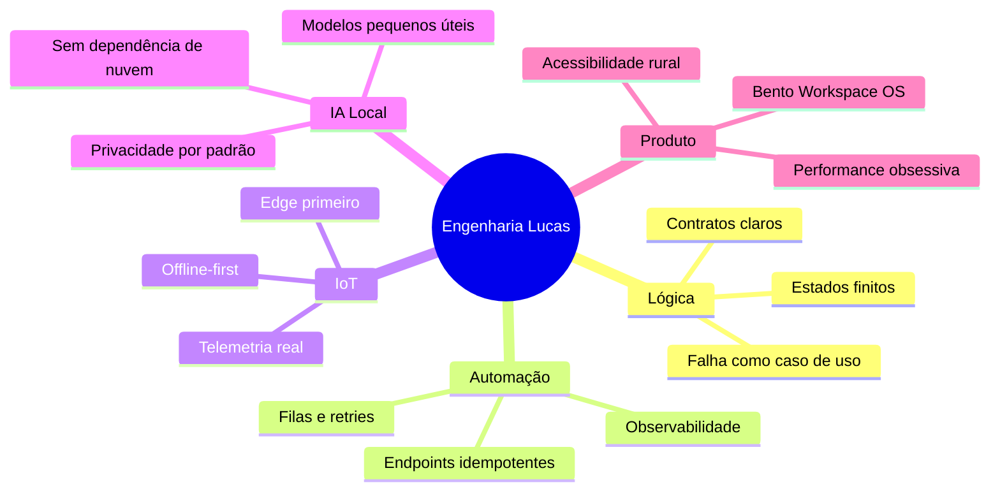
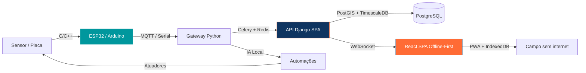
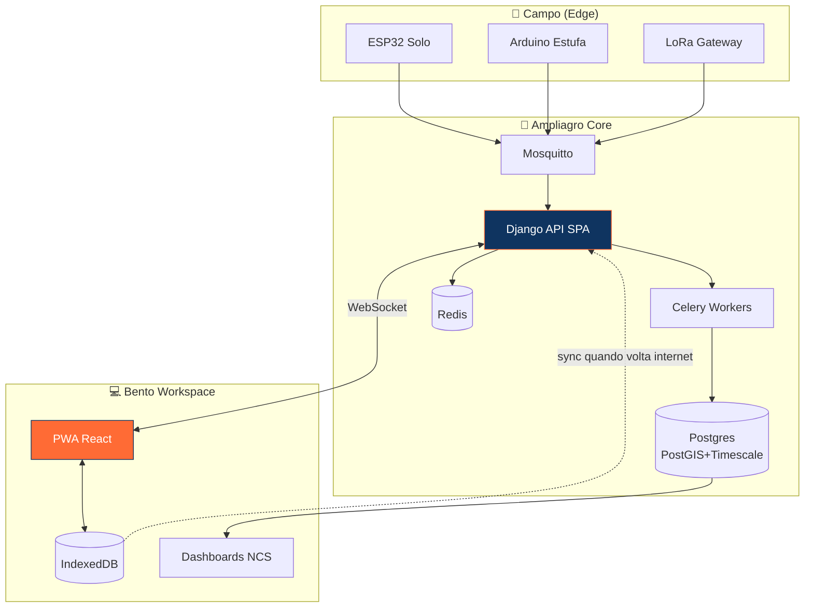
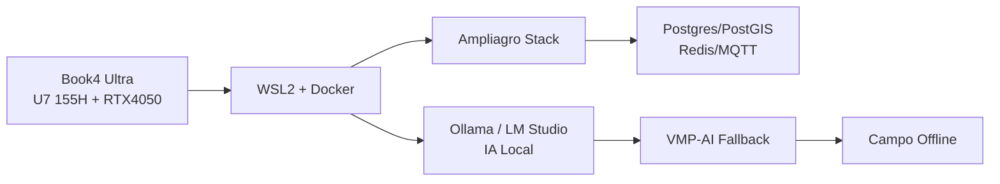
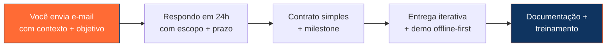

> 🇧🇷 **Português** · 🇬🇧 [English](README.en.md) · 🌐 [Ampliagro OS](https://github.com/luck-of-luck/Ampliagro)

  
  
  
  

  
  
  
  
  

---

##  Sobre — Quem sou eu

> **Engenheiro de lógica de sistemas e automação com endpoints e IoT.** Especialista em **Arduino, ESP32 e família ESP** em blocos de código **C/C++ e Python**, desenvolvimento de **banco de dados e APIs em SPA**, e entusiasta de **IA local e tecnologia de automação pessoal offline-first**.

Me chamo **Lucas Tomaz Nunes** — desenvolvedor **backend / edge**, freelancer e estudante concluinte do **Técnico em Informática Integrado (3º/3) no IFSulDeMinas — Campus Muzambinho**. Atuo como **Monitor/Auxiliar em Tecnologias Web** (1º e 2º anos), ensinando base sólida de HTML/CSS/JS/TS, e como **fundador e arquiteto do AMPLIAGRO OS**.

Minha obsessão é **transformar campo em sistema operacional**: telemetria real, automação que não depende de nuvem, APIs que sobrevivem sem internet e interfaces que um produtor entende em 3 segundos. Código é meio — **lógica, confiabilidade e autonomia** são o fim.

- 🎓 **Formação:** IFSulDeMinas — Muzambinho (Técnico em Informática Integrado) — *concluindo 2026*
- 💼 **Atuação:** Freelancer Backend & IoT | Monitor Web | Founder **AMPLIAGRO OS / VMP-AI**
- 🎯 **Core:** Engenharia de Sistemas, Lógica de Programação, Automação com Endpoints, Integração de Sensores, APIs Assíncronas
- 🧠 **Stack de guerra:** `C/C++ embarcado` · `Python (Django/FastAPI/Celery)` · `TypeScript/React SPA` · `PostgreSQL/PostGIS/TimescaleDB/Redis/MQTT`
- 🌾 **Visão:** Agro 5.0 acessível, offline-first, com IA embarcada e custo operacional previsível
- 🗣️ **Idiomas:** Português (nativo) · Inglês (intermediário técnico)

---

## 🧭 Visão de Mundo, Filosofia de Engenharia e Instituição

### IFSulDeMinas — onde lógica vira sistema
Formação técnica integral que me deu **base de hardware + software + redes + lógica**. Lá aprendi que **engenharia não é framework da moda, é contrato com o mundo físico**: sensor mente, rede cai, energia oscila — seu código precisa continuar correto. Essa escola me moldou para projetar **sistemas que degradam graciosamente** e **nunca perdem dados**.

### Princípios que carrego

> **"Se o sistema só funciona com internet boa, ele não funciona para o agro."** — por isso tudo que desenho é **offline-first, fila-compatível e auditável**.

---

## 🗓️ Linha do Tempo — Formação, Conhecimento e Trajetória

| Ano | Marco | Conhecimento consolidado |
|-----|-------|--------------------------|
| **2023-2024** | Ingresso IFSul Muzambinho + Monitoria Web | Base de **lógica, redes, SO, banco de dados**, ensino de HTML/CSS/JS/TS |
| **2024** | Primeiros sistemas embarcados | **Arduino Uno/Nano, ESP32/ESP8266**, leitura de sensores, controle de atuadores em **C/C++** |
| **2024-2025** | Freelancer Backend & IoT | **Python (Django, FastAPI)**, **APIs SPA assíncronas**, filas, tráfego de dados |
| **2025** | **AMPLIAGRO OS** — fundação | Arquitetura **Bento Workspace OS**, matriz cartesiana snapping, NCS design, offline-first |
| **2025-2026** | AMPLIAGRO como plataforma enterprise | **VMP-AI**, SLSA L3, Sigstore, SBOM/VEX, mutation/contract/visual/chaos testing |
| **2026 →** | Agro 5.0 com IA Local | **IA embarcada, automação pessoal local, edge AI** sem dependência de nuvem |

---

## 🛠️ Arsenal Técnico — Do Silício ao Dashboard

### 🔥 Linguagens de Guerra

### 🌐 Frontend & SPA

### 🧱 Backend, Dados & Mensageria

### 🤖 IoT, Edge & Hardware
     

### 🧪 Qualidade Enterprise (o que levamos ao Ampliagro)
    

### 📋 Stack completo — o que domino e onde aplico

| Domínio | Tecnologias & Ferramentas | Onde uso no dia a dia |
|---|---|---|
| **Linguagens** | Python, **C**, **C++**, C#, PHP, JavaScript, **TypeScript**, SQL, Shell, Portugol | Firmware ESP32, APIs, SPA, scripts de campo |
| **Embarcado / IoT** | Arduino (Uno/Nano/Mega), **ESP32/ESP8266**, sensores (DHT22, DS18B20, HX711, MPU6050), relés, LoRa, MQTT, BLE | Telemetria Ampliagro, automação de estufa, silo, irrigação |
| **Backend & APIs SPA** | **Django 5 + DRF + Channels + Celery**, FastAPI, Node.js, REST/WebSocket, JWT, RBAC/ABAC, LGPD | Ampliagro OS, VMP-AI coordinator |
| **Dados** | **PostgreSQL + PostGIS + TimescaleDB**, Redis, SQLite, IndexedDB (offline), Mosquitto | Mapas de talhão, séries temporais, fila offline |
| **Frontend PWA** | React 18 + Vite + TanStack Query + Zustand + Tailwind + PWA + IndexedDB | Bento Workspace, dashboards NCS, modo campo sem internet |
| **Infra & Qualidade** | Docker + Compose, Caddy/Nginx, GitHub Actions, **SLSA L3 + Sigstore + SBOM (CycloneDX/SPDX) + VEX**, Prometheus/Grafana/Loki/Tempo/Pyroscope | CI/CD enterprise do Ampliagro |
| **Testes Avançados** | Pytest, Vitest/Jest, Playwright (E2E + visual), **Stryker/mutmut (mutation) + Pact (contract) + Litmus (chaos) + k6** | Pipeline `advanced-testing.yml` |
| **IA & Automação Local** | Python ML, ONNX, automações n8n locais, voice assistant offline, orquestração multi-modelo | VMP-AI fallback inteligente |

---

## 📊 Métricas, Commits, PRs & Atividade — Transparência Total

  

  

---

## 🚀 Projetos em Destaque

### 🌾 [AMPLIAGRO OS](https://github.com/luck-of-luck/Ampliagro) — *O Sistema Operacional do Agro 5.0* ⭐

> **Fundador & Arquiteto Principal.** Ecossistema agrícola sob conceito **Bento Workspace OS** — não é "mais um dashboard", é um **sistema operacional rural**: matriz cartesiana snapping, design NCS sem poluição visual, **offline-first real**, telemetria e custo rastreável por talhão.

**O que torna elite (e o que construímos juntos neste repo):**

| Pilar | O que entreguei |
|---|---|
| **Arquitetura** | Django 5 + DRF + Channels + Celery + React 18 + Vite + TanStack Query + Zustand + Caddy |
| **Dados & Tempo Real** | PostgreSQL + **PostGIS** + **TimescaleDB** (hypertables) + Redis + **Mosquitto (MQTT)** + WebSocket |
| **Offline-First & PWA** | Service Worker + IndexedDB + fila de sync + `Idempotency-Key` + modo campo sem internet |
| **Qualidade Enterprise** | **Semantic Release** (PyPI/Docker/npm), **SLSA Level 3 + Sigstore + SBOM (CycloneDX/SPDX) + VEX** |
| **Testes que importam** | **Stryker/mutmut (mutation ≥80%) + Pact (contract) + Playwright visual + Litmus (chaos) + k6 + axe (a11y)** |
| **Observabilidade** | **Prometheus + Grafana + Loki + Tempo + Pyroscope + OTel** + SLO/SLI + Error Budget + burn-rate alerting |
| **Segurança & Compliance** | Trivy, TruffleHog, Bandit, Safety, dependência, CLA/DCO, export-control |
| **DX & Gov** | DevContainer + Codespaces, Docusaurus v3, RFC/ADR, contributor ladder, mentorship |

**Stack resumida:** `Python` `Django` `C/C++` `TypeScript` `PostGIS` `TimescaleDB` `MQTT` `React` `PWA` `SLSA L3`

---

### 🤖 VMP-AI — Orquestração Multi-Modelo com Fallback Inteligente

Coordenador que implementa **fallback sagrado**: `cline/minimax → deepseek → Copilot → Claude → Kimi → OpenRouter :free → LM Studio → Ollama local`. Nunca trava em 429/quota — **troca de modelo e avisa**. Base do Hermes Agent adaptado para campo.

### 📡 Projetos IoT & Automação (seleção)

| Projeto | O que faz | Tecnologias |
|---|---|---|
| **Field Telemetry Node** | Nós ESP32 com deep-sleep, fila offline e OTA | `ESP32` `C++` `MQTT` `ArduinoJson` `DeepSleep` |
| **Automação de Irrigação** | Controle por umidade + previsão + custo por talhão | `Python` `Celery` `PostGIS` `Relés` |
| **Silo Monitor** | Peso (HX711) + temperatura + alertas | `Arduino` `HX711` `DHT22` `MQTT` |
| **Voz Offline** | Assistente local sem nuvem | `Python` `Whisper` `TTS` `n8n local` |

---

## 🖥️ Workstation — Onde a mágica é compilada

### 💻 Samsung Book4 Ultra — Estação Principal

| Componente | Especificação |
|---|---|
| **CPU** | Intel Core **Ultra 7 155H** (16 cores / 22 threads, Arc iGPU + NPU) |
| **GPU** | NVIDIA **GeForce RTX 4050 Laptop 6GB GDDR6** |
| **RAM** | 32GB LPDDR5X |
| **Tela** | 16" AMOLED 2880×1800 Touch |
| **SO** | Windows 11 Pro + **WSL2 (Ubuntu)** |
| **Stack Local** | Docker Desktop + Ollama (`qwen2.5-coder:32b`, `llama3.3:70b`) + LM Studio + OpenCode + Hermes Agent |

> **Filosofia local-first:** rodo **IA offline** quando preciso — `Ollama` e `LM Studio` como último fallback do VMP-AI. Privacidade, custo zero e campo sem internet agradecem.

---

## 📫 Contato — Vamos construir algo útil

### 📧 **E-mail é o canal PRINCIPAL — respondo em até 24h**

<em>Para orçamentos, parcerias, freelas backend/IoT e Ampliagro — use o e-mail acima. É o único canal com SLA.</em>

---

### 🌐 Redes & Perfis Oficiais

 

| Canal | Link / Handle | Uso recomendado |
|---|---|---|
| **📧 E-mail (PRINCIPAL)** | **[lucastnunes2@gmail.com](mailto:lucastnunes2@gmail.com)** | **Orçamentos, freelas, parcerias, Ampliagro** |
| 💼 LinkedIn | [linkedin.com/in/lucas-tomaz-nunes](https://linkedin.com/in/lucas-tomaz-nunes) | Networking profissional |
| 🎓 Lattes | [CNPq 4066866536009474](http://lattes.cnpq.br/4066866536009474) | Currículo acadêmico |
| 👨‍💻 GitHub | [@luck-of-luck](https://github.com/luck-of-luck) | Código, issues, PRs |
| 📘 Facebook | [facebook.com/lucas.tomaz.nunes](https://facebook.com/lucas.tomaz.nunes) | Contato social |
| 📸 Instagram | [@luck_of_luck](https://instagram.com/luck_of_luck) | Bastidores, campo, builds |
| 💬 WhatsApp | [wa.me/5535999999999](https://wa.me/5535999999999) | Conversa rápida (após e-mail) |
| 📞 Telefone | `+55 35 9XXXX-XXXX` | Emergências / voz |

> ⚠️ **Nota:** WhatsApp/Telefone exibidos com máscara por privacidade. **Envie e-mail primeiro** com contexto — respondo com número direto.

---

### 🧭 Como prefiro trabalhar

**Stack de entrega:** `Git + Conventional Commits + PRs revisáveis + CI verde + docs vivas`.  
**Compromisso:** código que **funciona sem internet, explica o porquê e pode ser mantido por outra pessoa**.

---

  <b>AMPLIA</b>IA · ENGENHARIA DE SISTEMAS · IOT & AUTOMAÇÃO · BACKEND SPA 
  Book4 Ultra • Ultra 7 155H • RTX 4050 • WSL2 • Ollama Local • Campo Offline-First 
  Muzambinho — MG • IFSulDeMinas • Ampliagro OS • VMP-AI

